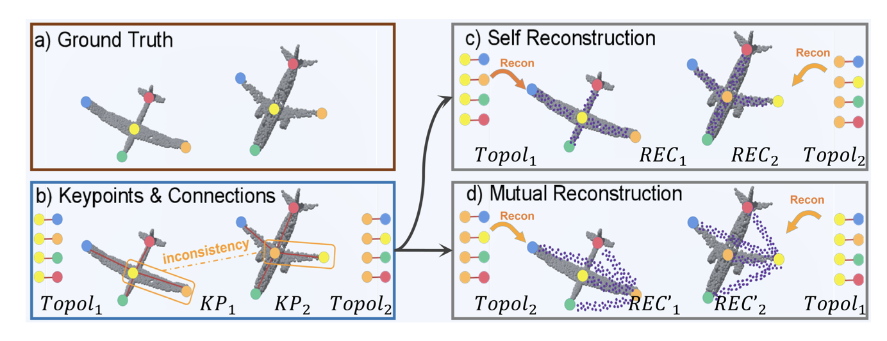

   
    <!-- 
    
          
    
  -->
    
 
            <b>Haocheng Yuan</b>, Jing Xu, Hao Pan, Adrien Bousseau, Niloy J Mitra, Changjian Li 

[Download paper here](https://openaccess.thecvf.com/content/CVPR2024/papers/Yuan_CADTalk_An_Algorithm_and_Benchmark_for_Semantic_Commenting_of_CAD_CVPR_2024_paper.pdf)

