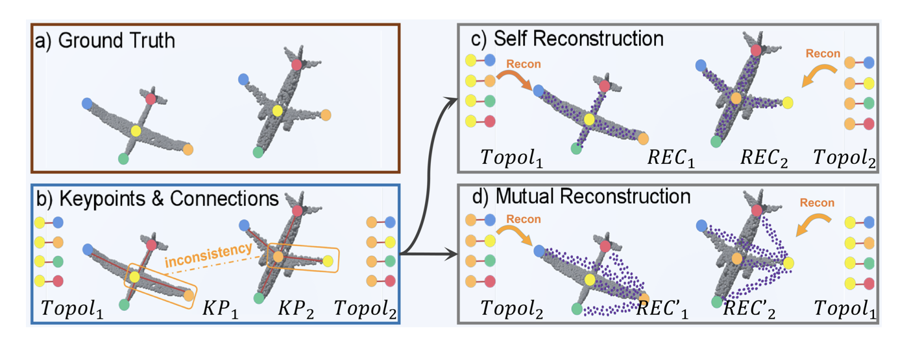

   
    <!-- 
    
          
    
  -->
    
 
            <b>Haocheng Yuan</b>, Adrien Bousseau, Hao Pan, Chengquan Zhang, Niloy J Mitra, Changjian Li 

[Download paper here](https://arxiv.org/pdf/2409.01421)

