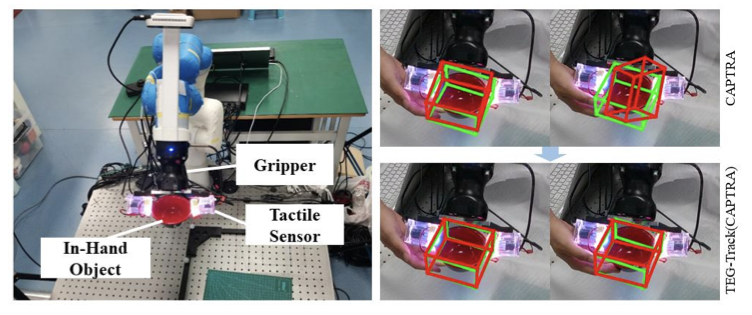

   
    
    
          
    
 
    
 
     	   <u>we present a tactile-enhanced generalizable 6D pose tracking design named TEG-Track to track previously unseen in-hand objects</u>
    

[Download paper here](http://academicpages.github.io/files/paper3.pdf)

Xiaomeng Xu, Yun Liu, Weihang Chen, **Haocheng Yuan**, He Wang, Jing Xu, Rui Chen, Li Yi