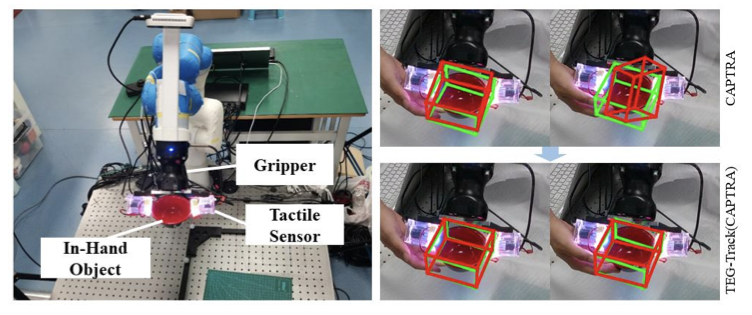

   
    <!-- 
    
          
    
  -->
    
 
     	   Xiaomeng Xu, Yun Liu, Weihang Chen, <b>Haocheng Yuan</b>, He Wang, Jing Xu, Rui Chen, Li Yi 
    

[Download paper here](http://academicpages.github.io/files/paper3.pdf)

